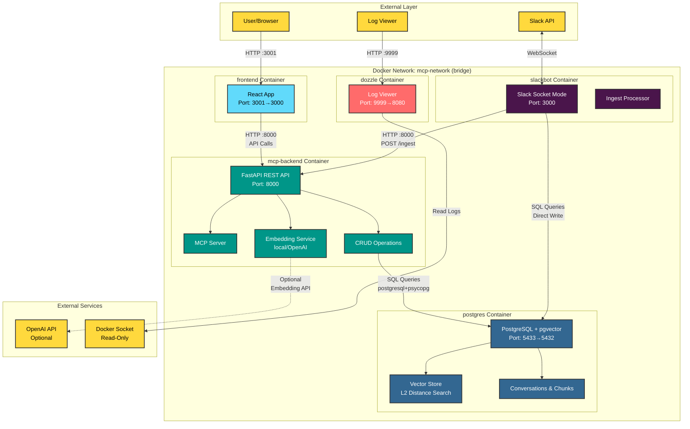
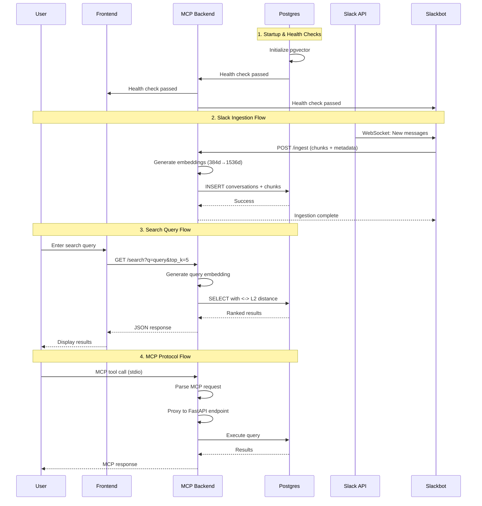
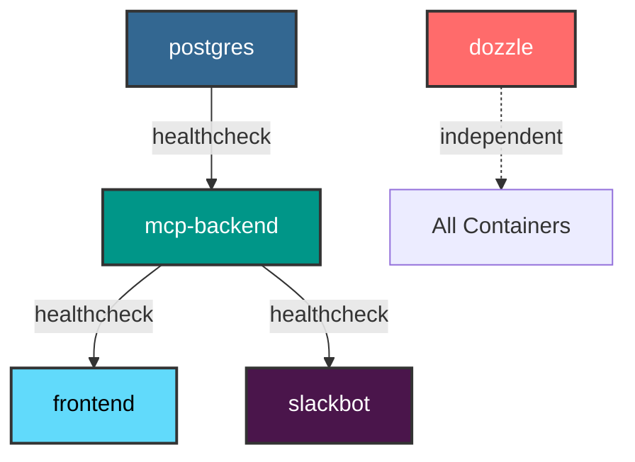
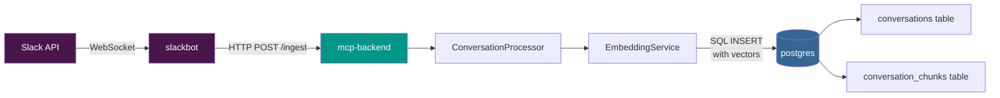
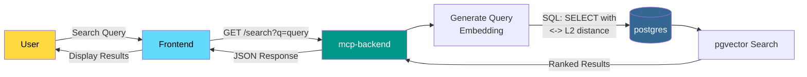
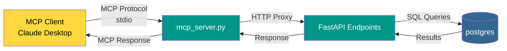
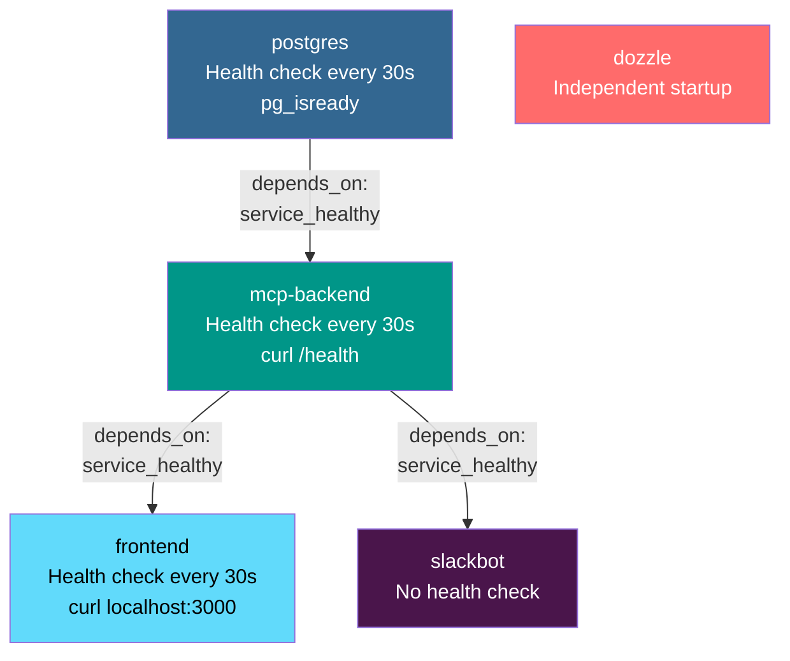
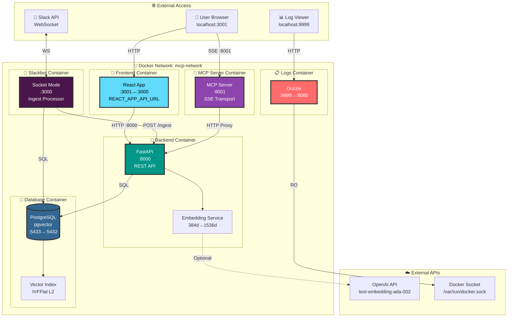

# Docker Compose Architecture Diagram - MCP Demo

## Architecture Overview (Mermaid)



## Service Communication Flow



## Container Dependencies



## Detailed Service Communication

### 1. **postgres** → Base de Datos
- **Imagen**: `pgvector/pgvector:pg15`
- **Puerto**: `5433:5432` (host:container)
- **Función**: Almacenamiento de vectores y datos conversacionales
- **Comunicación**:
  - Recibe conexiones de: `mcp-backend`, `slackbot`
  - Protocolo: PostgreSQL (`postgresql+psycopg://`)

### 2. **mcp-backend** → API Principal
- **Build**: Dockerfile local
- **Puerto**: `8000:8000`
- **Función**: 
  - API REST para operaciones CRUD
  - Servidor MCP (Model Context Protocol)
  - Generación de embeddings (local o OpenAI)
  - Búsqueda semántica con pgvector
- **Comunicación**:
  - **← frontend**: Recibe peticiones HTTP en puerto 8000
  - **← slackbot**: Recibe peticiones HTTP en puerto 8000
  - **→ postgres**: Conecta a postgres:5432 para queries SQL
  - **→ OpenAI API**: (Opcional) Para embeddings si está configurado
- **Dependencias**: Espera a que postgres esté healthy

### 3. **frontend** → Interfaz de Usuario
- **Build**: ./frontend/Dockerfile
- **Puerto**: `3001:3000` (host:container)
- **Función**: Interfaz React para interactuar con el sistema
- **Comunicación**:
  - **← Usuario**: Recibe peticiones del navegador en localhost:3001
  - **→ mcp-backend**: Hace llamadas HTTP a http://localhost:8000
- **Dependencias**: Espera a que mcp-backend esté healthy

### 4. **slackbot** → Integración Slack
- **Build**: ./slack/Dockerfile
- **Puerto**: `3000:3000`
- **Función**: 
  - Recibe mensajes de Slack vía Socket Mode
  - Procesa e ingesta conversaciones
  - Envía respuestas usando embeddings
- **Comunicación**:
  - **← Slack API**: Conexión WebSocket bidireccional
  - **→ mcp-backend**: Llama al endpoint de ingesta http://mcp-backend:8000
  - **→ postgres**: (Directa) Puede escribir datos directamente
  - **→ OpenAI API**: (Opcional) Para embeddings
- **Dependencias**: Espera a que mcp-backend esté healthy

### 5. **dozzle** → Monitoreo de Logs
- **Imagen**: `amir20/dozzle:latest`
- **Puerto**: `9999:8080`
- **Función**: Visualización de logs de todos los contenedores
- **Comunicación**:
  - **← Usuario**: Acceso web en localhost:9999
  - **→ Docker Socket**: Lee logs de /var/run/docker.sock (read-only)

## Main Data Flows

### Flow 1: Slack Ingestion


### Flow 2: Semantic Search


### Flow 3: MCP Operations


## Key Environment Variables

| Variable | postgres | mcp-backend | frontend | slackbot | dozzle |
|----------|----------|-------------|----------|----------|--------|
| DATABASE_URL | ❌ | ✅ | ❌ | ✅ | ❌ |
| OPENAI_API_KEY | ❌ | ✅ | ❌ | ✅ | ❌ |
| SLACK_BOT_TOKEN | ❌ | ✅ | ❌ | ✅ | ❌ |
| SLACK_APP_TOKEN | ❌ | ❌ | ❌ | ✅ | ❌ |
| FASTAPI_BASE_URL | ❌ | ✅ | ❌ | ✅ | ❌ |
| REACT_APP_API_URL | ❌ | ❌ | ✅ | ❌ | ❌ |

## Health Checks and Dependencies



## Network and Volumes

- **Network**: `mcp-network` (bridge) - All services share this network
- **Volumes**:
  - `postgres_data`: PostgreSQL database persistence
  - Bind mounts: For development (hot reload in frontend and backend)

## Exposed Ports to Host

| Service | Host Port | Container Port | Purpose |
|----------|-------------|------------------|-----------|
| postgres | 5433 | 5432 | PostgreSQL Database |
| mcp-backend | 8000 | 8000 | FastAPI REST API |
| mcp-server | 8001 | 8001 | MCP Server (SSE) |
| frontend | 3001 | 3000 | React Web Interface |
| slackbot | 3000 | 3000 | Slack Webhook (if applicable) |
| dozzle | 9999 | 8080 | Log Viewer |

## Important Notes

1. **Internal Communication**: Services use service names (e.g., `postgres:5432`, `mcp-backend:8000`) within the Docker network.

2. **External Communication**: The host accesses via `localhost` with mapped ports (e.g., `localhost:8000`, `localhost:3001`).

3. **Startup Order**: 
   1. postgres → waits for health check
   2. mcp-backend → waits for postgres healthy
   3. frontend, slackbot, and mcp-server → wait for mcp-backend healthy
   4. dozzle → starts independently

4. **Configuration Redundancy**: Both `mcp-backend` and `slackbot` have direct access to postgres and can generate embeddings.

5. **MCP Server Access**: 
   - **Local stdio mode**: Use `run_mcp_server_standalone.py` directly for Claude Desktop
   - **Network SSE mode**: Docker container exposes port 8001 for remote MCP clients
   - Connect external MCP clients to: `http://localhost:8001/sse`

## Connecting External MCP Clients

### Option 1: Local stdio (Claude Desktop)
```json
{
  "mcpServers": {
    "mcp-demo": {
      "command": "python",
      "args": ["/path/to/MCP-Demo/run_mcp_server_standalone.py"],
      "env": {
        "FASTAPI_BASE_URL": "http://localhost:8000"
      }
    }
  }
}
```

### Option 2: Docker SSE (Network Access)
```json
{
  "mcpServers": {
    "mcp-demo": {
      "url": "http://localhost:8001/sse",
      "transport": "sse"
    }
  }
}
```

### Testing MCP Server
```bash
# Check if MCP server is running
curl http://localhost:8001/health

# Test SSE connection
curl -N http://localhost:8001/sse
```

## Architecture Diagram (Complete View)


