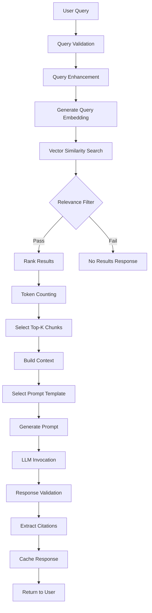

# LangChain Integration Architecture
# Phase 4: RAG (Retrieval-Augmented Generation)

**Version:** 1.0  
**Date:** November 8, 2025  
**Status:** Design Document  
**Architect:** Software Architecture Agent

---

## Table of Contents

1. [Executive Summary](#executive-summary)
2. [Architecture Overview](#architecture-overview)
3. [RAG Pipeline Design](#rag-pipeline-design)
4. [LangChain Component Selection](#langchain-component-selection)
5. [Integration Points](#integration-points)
6. [Prompt Engineering](#prompt-engineering)
7. [Quality and Safety](#quality-and-safety)
8. [Performance Optimization](#performance-optimization)
9. [Configuration Strategy](#configuration-strategy)
10. [Implementation Roadmap](#implementation-roadmap)

---

## Executive Summary

This document defines the architecture for integrating LangChain to provide Retrieval-Augmented Generation (RAG) capabilities to the MCP Demo project. The design maintains the hexagonal architecture principles established in Phase 3, treating LangChain as an adapter rather than a core dependency.

### Key Design Principles

✅ **Hexagonal Architecture Compliance**: LangChain is an adapter, not a core dependency  
✅ **Provider Agnostic**: Support multiple LLM providers (OpenAI, Anthropic, local models)  
✅ **Configuration-Driven**: Runtime selection of providers and models  
✅ **Testable**: Full dependency injection with mocking support  
✅ **Safe & Reliable**: Guardrails, validation, and fallback mechanisms  
✅ **Cost-Optimized**: Token management and caching strategies  

### Strategic Goals

1. Enable natural language question answering over ingested conversations
2. Provide context-aware responses with source citations
3. Support multiple LLM providers without vendor lock-in
4. Maintain cost control through caching and optimization
5. Ensure safety through content validation and guardrails

---

## Architecture Overview

### Hexagonal Architecture with LangChain

```
┌─────────────────────────────────────────────────────────────────┐
│                     PRESENTATION LAYER                           │
│  FastAPI REST API + MCP Server                                   │
└────────────────────────┬────────────────────────────────────────┘
                         │
┌────────────────────────▼────────────────────────────────────────┐
│                    APPLICATION LAYER                             │
│                                                                  │
│  ┌──────────────────┐  ┌──────────────────┐  ┌──────────────┐ │
│  │ IngestConversation│ │SearchConversations│ │  RAGService  │ │
│  │   Use Case       │  │    Use Case       │  │  Use Case    │ │
│  └──────────────────┘  └──────────────────┘  └──────┬───────┘ │
└─────────────────────────────────────────────────────┼──────────┘
                                                       │
┌──────────────────────────────────────────────────────▼──────────┐
│                       DOMAIN LAYER                               │
│                                                                  │
│  ┌──────────────────────────────────────────────────────────┐  │
│  │              PORT INTERFACES (Abstract)                   │  │
│  │  • IRAGProvider                (NEW)                      │  │
│  │  • IPromptTemplateManager      (NEW)                      │  │
│  │  • IConversationMemoryService  (NEW)                      │  │
│  │  • ILLMProvider                (NEW)                      │  │
│  │  • IVectorSearchRepository     (existing)                 │  │
│  │  • IEmbeddingService           (existing)                 │  │
│  └──────────────────────────────────────────────────────────┘  │
└────────────────────────┬────────────────────────────────────────┘
                         │
┌────────────────────────▼────────────────────────────────────────┐
│                   ADAPTER LAYER (Phase 4)                        │
│                                                                  │
│  ┌──────────────────────────────────────────────────────────┐  │
│  │         LANGCHAIN ADAPTERS (NEW)                          │  │
│  │                                                            │  │
│  │  ┌────────────────────────────────────────────────────┐  │  │
│  │  │  LangChainRAGAdapter                                │  │  │
│  │  │  • Orchestrates RAG pipeline                        │  │  │
│  │  │  • Coordinates retrieval + generation               │  │  │
│  │  │  • Manages conversation context                     │  │  │
│  │  └────────────────────────────────────────────────────┘  │  │
│  │                                                            │  │
│  │  ┌────────────────────────────────────────────────────┐  │  │
│  │  │  LLM Provider Adapters                              │  │  │
│  │  │  • OpenAILLMAdapter                                 │  │  │
│  │  │  • AnthropicLLMAdapter                              │  │  │
│  │  │  • LocalLLMAdapter (via LangChain)                  │  │  │
│  │  └────────────────────────────────────────────────────┘  │  │
│  │                                                            │  │
│  │  ┌────────────────────────────────────────────────────┐  │  │
│  │  │  Prompt Template Adapter                            │  │  │
│  │  │  • LangChainPromptTemplateAdapter                   │  │  │
│  │  │  • Template library management                      │  │  │
│  │  │  • Dynamic template selection                       │  │  │
│  │  └────────────────────────────────────────────────────┘  │  │
│  │                                                            │  │
│  │  ┌────────────────────────────────────────────────────┐  │  │
│  │  │  Memory Adapters                                    │  │  │
│  │  │  • ConversationBufferMemoryAdapter                  │  │  │
│  │  │  • ConversationSummaryMemoryAdapter                 │  │  │
│  │  │  • VectorStoreMemoryAdapter                         │  │  │
│  │  └────────────────────────────────────────────────────┘  │  │
│  │                                                            │  │
│  │  ┌────────────────────────────────────────────────────┐  │  │
│  │  │  Vector Store Integration                           │  │  │
│  │  │  • PgVectorLangChainAdapter                         │  │  │
│  │  │  • Bridges existing pgvector with LangChain         │  │  │
│  │  └────────────────────────────────────────────────────┘  │  │
│  └──────────────────────────────────────────────────────────┘  │
│                                                                  │
│  ┌──────────────────────────────────────────────────────────┐  │
│  │         EXISTING ADAPTERS (Phase 3)                       │  │
│  │  • Persistence Adapters (PostgreSQL + pgvector)          │  │
│  │  • Embedding Service Adapters (Local/OpenAI/FastEmbed)   │  │
│  └──────────────────────────────────────────────────────────┘  │
└────────────────────────┬────────────────────────────────────────┘
                         │
┌────────────────────────▼────────────────────────────────────────┐
│                    INFRASTRUCTURE                                │
│  • PostgreSQL + pgvector                                         │
│  • OpenAI API / Anthropic API / Local LLM                        │
│  • Redis (optional caching)                                      │
└─────────────────────────────────────────────────────────────────┘
```

### Architecture Rationale

1. **LangChain as Adapter**: LangChain components are wrapped in adapter classes that implement domain port interfaces
2. **Provider Abstraction**: LLM providers are abstracted behind `ILLMProvider` interface
3. **Separation of Concerns**: RAG logic separated into retrieval, generation, and orchestration
4. **Testability**: All adapters can be mocked for testing
5. **Flexibility**: Easy to swap providers or add new ones

---

## RAG Pipeline Design

### Pipeline Architecture

```
┌─────────────────────────────────────────────────────────────────┐
│                      RAG PIPELINE                                │
│                                                                  │
│  1. Query Processing                                             │
│     ├─> Query validation                                         │
│     ├─> Query enhancement (multi-query if needed)                │
│     └─> Query embedding generation                               │
│                                                                  │
│  2. Retrieval Stage                                              │
│     ├─> Semantic search (vector similarity)                      │
│     ├─> Relevance filtering (score threshold)                    │
│     ├─> Result ranking & reranking                               │
│     └─> Metadata filtering (date, author, etc.)                  │
│                                                                  │
│  3. Context Construction                                         │
│     ├─> Token counting & context window management               │
│     ├─> Context chunk selection (top-k with diversity)           │
│     ├─> Context formatting (structured prompt)                   │
│     └─> Conversation history integration                         │
│                                                                  │
│  4. Generation Stage                                             │
│     ├─> Prompt template selection                                │
│     ├─> LLM invocation with context                              │
│     ├─> Response streaming (optional)                            │
│     └─> Response validation                                      │
│                                                                  │
│  5. Post-Processing                                              │
│     ├─> Source citation extraction                               │
│     ├─> Answer quality validation                                │
│     ├─> Hallucination detection                                  │
│     └─> Response caching                                         │
│                                                                  │
└─────────────────────────────────────────────────────────────────┘
```

### Pipeline Flow Diagram



### Retrieval Strategy

#### Multi-Query Retrieval

For complex queries, generate multiple variations to improve recall:

```python
# Example multi-query strategy
original_query = "What did John say about the project timeline?"

query_variations = [
    original_query,
    "project timeline discussion by John",
    "John's comments on schedule",
    "timeline estimates from John"
]
```

#### Hybrid Search Strategy

Combine multiple retrieval approaches:

1. **Semantic Search** (vector similarity)
   - Primary retrieval method
   - Uses embedding similarity
   - Best for semantic understanding

2. **Keyword Search** (optional enhancement)
   - Supplementary retrieval
   - Uses BM25 or full-text search
   - Good for exact term matches

3. **Metadata Filtering**
   - Filter by author, date, conversation
   - Refine results based on context

#### Reranking Strategy

After initial retrieval, rerank results using:

1. **Cross-Encoder Models** (optional)
   - More accurate relevance scoring
   - Higher computational cost
   - Use for critical queries

2. **Diversity Ranking**
   - Avoid redundant chunks
   - Maximize information diversity
   - Balance relevance and coverage

### Context Window Management

#### Token Budget Allocation

```
Total Context Window (e.g., 8K tokens for GPT-3.5)
├─> System Prompt:           ~500 tokens
├─> Retrieved Context:       ~3500 tokens (max)
├─> Conversation History:    ~1000 tokens (max)
├─> User Query:              ~100 tokens
└─> Response Buffer:         ~2900 tokens
```

#### Dynamic Context Selection

```python
# Pseudo-code for context selection
def select_context_chunks(
    chunks: List[Chunk],
    max_tokens: int = 3500
) -> List[Chunk]:
    selected = []
    token_count = 0
    
    for chunk in chunks:
        chunk_tokens = count_tokens(chunk.text)
        
        if token_count + chunk_tokens <= max_tokens:
            selected.append(chunk)
            token_count += chunk_tokens
        else:
            break
    
    return selected
```

#### Conversation History Management

- **Buffer Strategy**: Keep last N messages
- **Summary Strategy**: Summarize old conversations
- **Vector Strategy**: Store conversation embeddings

---

## LangChain Component Selection

### Core LangChain Components

#### 1. LLM Providers

**OpenAI Integration**
```python
from langchain_openai import ChatOpenAI

llm = ChatOpenAI(
    model="gpt-4",
    temperature=0.7,
    max_tokens=2000
)
```

**Anthropic Integration**
```python
from langchain_anthropic import ChatAnthropic

llm = ChatAnthropic(
    model="claude-3-opus-20240229",
    temperature=0.7,
    max_tokens=2000
)
```

**Local Models (via Ollama)**
```python
from langchain_community.llms import Ollama

llm = Ollama(
    model="llama2",
    temperature=0.7
)
```

#### 2. Prompt Templates

**Basic QA Template**
```python
from langchain.prompts import PromptTemplate

qa_template = PromptTemplate(
    input_variables=["context", "question"],
    template="""You are a helpful assistant analyzing conversation data.

Context from conversations:
{context}

Question: {question}

Please provide a detailed answer based on the context above. If the answer is not in the context, say so.

Answer:"""
)
```

**Conversational Template**
```python
from langchain.prompts import ChatPromptTemplate

conversational_template = ChatPromptTemplate.from_messages([
    ("system", "You are analyzing conversation data. Use the provided context to answer questions accurately."),
    ("human", "Context:\n{context}"),
    ("human", "{question}"),
])
```

#### 3. Memory Components

**Conversation Buffer Memory**
```python
from langchain.memory import ConversationBufferMemory

memory = ConversationBufferMemory(
    memory_key="chat_history",
    return_messages=True
)
```

**Conversation Summary Memory**
```python
from langchain.memory import ConversationSummaryMemory

memory = ConversationSummaryMemory(
    llm=llm,
    memory_key="chat_history"
)
```

#### 4. Chains

**RetrievalQA Chain** (stateless)
```python
from langchain.chains import RetrievalQA

qa_chain = RetrievalQA.from_chain_type(
    llm=llm,
    chain_type="stuff",  # or "map_reduce", "refine"
    retriever=vector_store.as_retriever(),
    return_source_documents=True
)
```

**ConversationalRetrievalChain** (with memory)
```python
from langchain.chains import ConversationalRetrievalChain

conversation_chain = ConversationalRetrievalChain.from_llm(
    llm=llm,
    retriever=vector_store.as_retriever(),
    memory=memory,
    return_source_documents=True
)
```

#### 5. Vector Store Integration

**PGVector with LangChain**
```python
from langchain_community.vectorstores import PGVector

vector_store = PGVector(
    connection_string=DATABASE_URL,
    embedding_function=embedding_service,
    collection_name="conversation_chunks",
    distance_strategy="cosine"
)
```

### Chain Type Selection Matrix

| Chain Type | Use Case | Pros | Cons |
|------------|----------|------|------|
| **stuff** | Small contexts | Simple, fast | Context limit |
| **map_reduce** | Large contexts | Handles big data | Multiple LLM calls |
| **refine** | Iterative improvement | Best quality | Slowest |
| **map_rerank** | Scoring answers | Good for ranking | Complex setup |

**Recommendation**: Start with `stuff` chain, upgrade to `map_reduce` if context exceeds token limits.

---

## Integration Points

### Domain Layer Interfaces

#### IRAGProvider Interface

```python
# app/domain/repositories.py (NEW)

from abc import ABC, abstractmethod
from typing import List, Optional, Dict, Any
from .value_objects import Embedding
from .entities import ConversationChunk

class IRAGProvider(ABC):
    """Port interface for RAG operations."""
    
    @abstractmethod
    async def generate_answer(
        self,
        query: str,
        context_chunks: List[ConversationChunk],
        conversation_history: Optional[List[Dict[str, str]]] = None,
        **kwargs
    ) -> Dict[str, Any]:
        """
        Generate an answer using RAG.
        
        Args:
            query: User question
            context_chunks: Retrieved context chunks
            conversation_history: Previous conversation turns
            **kwargs: Additional parameters (temperature, max_tokens, etc.)
            
        Returns:
            {
                "answer": str,
                "sources": List[Dict],
                "confidence": float,
                "model_used": str,
                "tokens_used": int
            }
        """
        pass
    
    @abstractmethod
    async def stream_answer(
        self,
        query: str,
        context_chunks: List[ConversationChunk],
        **kwargs
    ) -> AsyncGenerator[str, None]:
        """Stream answer generation token by token."""
        pass
```

#### IPromptTemplateManager Interface

```python
class IPromptTemplateManager(ABC):
    """Port interface for prompt template management."""
    
    @abstractmethod
    def get_template(self, template_name: str) -> Any:
        """Get a prompt template by name."""
        pass
    
    @abstractmethod
    def render_template(
        self,
        template_name: str,
        **kwargs
    ) -> str:
        """Render a template with variables."""
        pass
    
    @abstractmethod
    def register_template(
        self,
        template_name: str,
        template: Any
    ) -> None:
        """Register a new template."""
        pass
```

#### ILLMProvider Interface

```python
class ILLMProvider(ABC):
    """Port interface for LLM providers."""
    
    @abstractmethod
    async def generate(
        self,
        prompt: str,
        **kwargs
    ) -> str:
        """Generate text from prompt."""
        pass
    
    @abstractmethod
    async def generate_with_metadata(
        self,
        prompt: str,
        **kwargs
    ) -> Dict[str, Any]:
        """Generate with metadata (tokens, model info)."""
        pass
    
    @abstractmethod
    def count_tokens(self, text: str) -> int:
        """Count tokens in text."""
        pass
```

### Adapter Layer Implementation

#### LangChainRAGAdapter

```python
# app/adapters/outbound/rag/langchain_rag_adapter.py (NEW)

import logging
from typing import List, Optional, Dict, Any, AsyncGenerator
from langchain.chains import RetrievalQA, ConversationalRetrievalChain
from langchain.memory import ConversationBufferMemory

from app.domain.repositories import IRAGProvider
from app.domain.entities import ConversationChunk
from .llm_provider_adapter import ILLMProvider
from .prompt_template_adapter import IPromptTemplateManager

logger = logging.getLogger(__name__)


class LangChainRAGAdapter(IRAGProvider):
    """
    Adapter implementing RAG using LangChain components.
    
    This adapter wraps LangChain chains and provides a clean interface
    to the domain layer, maintaining hexagonal architecture principles.
    """
    
    def __init__(
        self,
        llm_provider: ILLMProvider,
        prompt_manager: IPromptTemplateManager,
        vector_store_adapter: Any,  # LangChain vector store
        default_chain_type: str = "stuff",
        enable_streaming: bool = True
    ):
        self.llm_provider = llm_provider
        self.prompt_manager = prompt_manager
        self.vector_store = vector_store_adapter
        self.chain_type = default_chain_type
        self.enable_streaming = enable_streaming
        
        # Initialize memory
        self.memory = ConversationBufferMemory(
            memory_key="chat_history",
            return_messages=True,
            output_key="answer"
        )
        
        logger.info(f"LangChainRAGAdapter initialized with chain_type={default_chain_type}")
    
    async def generate_answer(
        self,
        query: str,
        context_chunks: List[ConversationChunk],
        conversation_history: Optional[List[Dict[str, str]]] = None,
        **kwargs
    ) -> Dict[str, Any]:
        """
        Generate answer using LangChain RAG pipeline.
        """
        try:
            # Build retriever from context chunks
            retriever = self._build_retriever(context_chunks)
            
            # Select and configure chain
            chain = self._build_chain(retriever, **kwargs)
            
            # Load conversation history if provided
            if conversation_history:
                self._load_conversation_history(conversation_history)
            
            # Execute chain
            result = await chain.ainvoke({"question": query})
            
            # Extract sources
            sources = self._extract_sources(result.get("source_documents", []))
            
            return {
                "answer": result["answer"],
                "sources": sources,
                "confidence": self._calculate_confidence(result),
                "model_used": self.llm_provider.model_name,
                "tokens_used": self._count_tokens_used(query, result["answer"])
            }
            
        except Exception as e:
            logger.error(f"RAG generation failed: {str(e)}")
            raise
    
    async def stream_answer(
        self,
        query: str,
        context_chunks: List[ConversationChunk],
        **kwargs
    ) -> AsyncGenerator[str, None]:
        """
        Stream answer generation token by token.
        """
        if not self.enable_streaming:
            # Fallback to non-streaming
            result = await self.generate_answer(query, context_chunks, **kwargs)
            yield result["answer"]
            return
        
        # Implement streaming logic
        # (LangChain supports streaming via callbacks)
        # Details omitted for brevity
        pass
    
    def _build_retriever(self, chunks: List[ConversationChunk]):
        """Build LangChain retriever from chunks."""
        # Convert chunks to LangChain documents
        # Implementation details omitted
        pass
    
    def _build_chain(self, retriever, **kwargs):
        """Build appropriate LangChain chain."""
        if kwargs.get("use_conversation_memory", False):
            return ConversationalRetrievalChain.from_llm(
                llm=self.llm_provider.llm,
                retriever=retriever,
                memory=self.memory,
                return_source_documents=True,
                chain_type=self.chain_type
            )
        else:
            return RetrievalQA.from_chain_type(
                llm=self.llm_provider.llm,
                chain_type=self.chain_type,
                retriever=retriever,
                return_source_documents=True
            )
    
    def _extract_sources(self, source_docs: List) -> List[Dict]:
        """Extract source citations from documents."""
        return [
            {
                "chunk_id": doc.metadata.get("chunk_id"),
                "conversation_id": doc.metadata.get("conversation_id"),
                "relevance_score": doc.metadata.get("score", 0.0),
                "text_excerpt": doc.page_content[:200]
            }
            for doc in source_docs
        ]
    
    def _calculate_confidence(self, result: Dict) -> float:
        """Calculate confidence score for the answer."""
        # Heuristic based on source relevance scores
        source_docs = result.get("source_documents", [])
        if not source_docs:
            return 0.0
        
        scores = [doc.metadata.get("score", 0.0) for doc in source_docs]
        return sum(scores) / len(scores) if scores else 0.0
    
    def _count_tokens_used(self, query: str, answer: str) -> int:
        """Count total tokens used."""
        return (
            self.llm_provider.count_tokens(query) +
            self.llm_provider.count_tokens(answer)
        )
    
    def _load_conversation_history(self, history: List[Dict[str, str]]):
        """Load conversation history into memory."""
        for turn in history:
            self.memory.save_context(
                {"question": turn["question"]},
                {"answer": turn["answer"]}
            )
```

### Integration with Existing Search Infrastructure

```python
# app/application/rag_service.py (UPDATED)

class RAGService:
    """
    Enhanced RAG service using LangChain integration.
    """
    
    def __init__(
        self,
        search_use_case: SearchConversationsUseCase,
        rag_provider: IRAGProvider,
        config: RAGConfig
    ):
        self.search_use_case = search_use_case
        self.rag_provider = rag_provider
        self.config = config
    
    async def ask_question(
        self,
        query: str,
        top_k: int = 5,
        conversation_id: Optional[str] = None,
        **kwargs
    ) -> Dict[str, Any]:
        """
        Ask a question using RAG.
        
        Workflow:
        1. Use existing search infrastructure to retrieve relevant chunks
        2. Pass chunks to LangChain RAG adapter for answer generation
        3. Return answer with sources
        """
        # Step 1: Retrieve relevant chunks using existing search
        search_request = SearchConversationRequest(
            query=query,
            top_k=top_k,
            filters=SearchFilters(conversation_id=conversation_id) if conversation_id else None
        )
        
        search_response = await self.search_use_case.execute(search_request)
        
        if not search_response.success or not search_response.results:
            return {
                "answer": "I couldn't find relevant information to answer your question.",
                "sources": [],
                "confidence": 0.0
            }
        
        # Step 2: Convert search results to chunks
        context_chunks = self._convert_search_results_to_chunks(
            search_response.results
        )
        
        # Step 3: Generate answer using RAG provider
        result = await self.rag_provider.generate_answer(
            query=query,
            context_chunks=context_chunks,
            **kwargs
        )
        
        return result
```

---

## Prompt Engineering

### Prompt Template Library

#### 1. General QA Template

```python
QA_TEMPLATE = """You are a helpful AI assistant analyzing conversation data from a knowledge base.

Your task is to answer questions based solely on the provided context.

Context:
{context}

Question: {question}

Guidelines:
- Answer based only on the information in the context
- If the answer is not in the context, say "I don't have enough information to answer this question."
- Cite specific conversations or speakers when relevant
- Be concise but complete
- Use bullet points for multi-part answers

Answer:"""
```

#### 2. Conversation Analysis Template

```python
CONVERSATION_ANALYSIS_TEMPLATE = """You are an expert at analyzing conversations and extracting insights.

Conversations:
{context}

Question: {question}

Please analyze the conversations and provide:
1. Direct answer to the question
2. Key quotes supporting your answer
3. Different perspectives if any
4. Confidence level in your answer

Analysis:"""
```

#### 3. Multi-Turn Conversational Template

```python
CONVERSATIONAL_TEMPLATE = ChatPromptTemplate.from_messages([
    ("system", """You are a helpful AI assistant with access to a knowledge base of conversations.

Key behaviors:
- Remember previous questions in this conversation
- Build on previous answers when appropriate
- Cite sources when making claims
- Acknowledge uncertainty when appropriate"""),
    
    MessagesPlaceholder(variable_name="chat_history"),
    
    ("human", """Context from knowledge base:
{context}

Question: {question}"""),
])
```

#### 4. Source Citation Template

```python
CITATION_TEMPLATE = """You are an AI assistant that provides well-sourced answers.

Context from conversations:
{context}

Question: {question}

Instructions:
- Answer the question comprehensively
- Include citations for all claims: [Source: Conversation X, Speaker Y]
- If multiple sources support a point, list all
- Format your answer with clear attribution

Answer with citations:"""
```

#### 5. Summary Template

```python
SUMMARY_TEMPLATE = """Summarize the following conversation excerpts related to: {topic}

Conversation Excerpts:
{context}

Provide a comprehensive summary that:
- Highlights key points
- Identifies consensus and disagreements
- Notes important details
- Lists key participants

Summary:"""
```

### Few-Shot Learning Examples

```python
FEW_SHOT_EXAMPLES = [
    {
        "query": "What was discussed about the project deadline?",
        "context": "John: We need to push the deadline by 2 weeks. Sarah: I agree, the current timeline is too tight.",
        "answer": "The team discussed extending the project deadline by 2 weeks. John proposed this extension, and Sarah agreed, noting that the current timeline was too tight. [Sources: John, Sarah]"
    },
    {
        "query": "Who disagreed with the proposal?",
        "context": "Alice: I support this proposal. Bob: I have concerns about the cost. Charlie: I'm on board with Alice.",
        "answer": "Bob expressed disagreement with the proposal, specifically citing concerns about the cost. Alice and Charlie supported the proposal. [Sources: Bob (disagreement), Alice and Charlie (support)]"
    }
]
```

### Prompt Optimization Strategies

1. **Template Versioning**
   - Version control for prompt templates
   - A/B testing different prompts
   - Performance metrics per template

2. **Dynamic Prompt Selection**
   - Select template based on query type
   - Adapt to conversation context
   - Consider token budget

3. **Prompt Compression**
   - Remove redundant information
   - Summarize long contexts
   - Focus on relevant portions

4. **Chain-of-Thought Prompting**
```python
COT_TEMPLATE = """Think through this step by step.

Context: {context}
Question: {question}

Let's approach this systematically:
1. First, identify relevant information
2. Then, analyze the information
3. Finally, formulate a complete answer

Analysis:"""
```

---

## Quality and Safety

### Answer Validation Mechanisms

#### 1. Grounding Verification

```python
class AnswerValidator:
    """Validates that answers are grounded in source documents."""
    
    def validate_answer(
        self,
        answer: str,
        source_documents: List[ConversationChunk]
    ) -> Dict[str, Any]:
        """
        Validate answer against source documents.
        
        Returns:
            {
                "is_valid": bool,
                "grounding_score": float (0-1),
                "unsupported_claims": List[str],
                "warnings": List[str]
            }
        """
        # Check for hallucinations
        # Verify claims are supported by sources
        # Detect speculative language
        pass
    
    def check_hallucination(self, answer: str, sources: List[str]) -> bool:
        """Detect if answer contains unsupported information."""
        # Implementation using entailment models or heuristics
        pass
```

#### 2. Confidence Scoring

```python
def calculate_answer_confidence(
    relevance_scores: List[float],
    answer_length: int,
    source_diversity: float
) -> float:
    """
    Calculate confidence score for generated answer.
    
    Factors:
    - Average relevance of source documents
    - Answer length (too short or too long reduces confidence)
    - Source diversity (multiple sources increases confidence)
    """
    avg_relevance = sum(relevance_scores) / len(relevance_scores)
    
    length_penalty = 1.0
    if answer_length < 50:
        length_penalty = 0.8  # Too short
    elif answer_length > 1000:
        length_penalty = 0.9  # Very long
    
    diversity_bonus = min(1.0, source_diversity * 1.2)
    
    return avg_relevance * length_penalty * diversity_bonus
```

### Source Citation Strategy

```python
class CitationManager:
    """Manages source citations in generated answers."""
    
    def extract_citations(self, answer: str) -> List[Dict]:
        """Extract citation markers from answer."""
        # Parse [Source: ...] markers
        pass
    
    def verify_citations(
        self,
        answer: str,
        source_documents: List[ConversationChunk]
    ) -> bool:
        """Verify all citations are valid."""
        pass
    
    def format_citations(
        self,
        sources: List[ConversationChunk],
        format_style: str = "inline"  # or "footnote", "endnote"
    ) -> str:
        """Format citations according to style."""
        if format_style == "inline":
            return "[Source: {conversation_id}, {author}]"
        elif format_style == "footnote":
            return "[1] {conversation_title} - {author} - {date}"
```

### Content Guardrails

```python
class ContentGuardrails:
    """Safety mechanisms for RAG responses."""
    
    def __init__(self):
        self.inappropriate_topics = [
            "harmful content",
            "discriminatory language",
            # Add more as needed
        ]
    
    def check_query_safety(self, query: str) -> Tuple[bool, Optional[str]]:
        """
        Check if query is appropriate.
        
        Returns:
            (is_safe, reason_if_unsafe)
        """
        # Content moderation logic
        pass
    
    def sanitize_response(self, response: str) -> str:
        """Remove any inappropriate content from response."""
        # Sanitization logic
        pass
    
    def detect_pii(self, text: str) -> List[str]:
        """Detect personally identifiable information."""
        # PII detection (emails, phone numbers, etc.)
        pass
```

### Hallucination Detection

```python
class HallucinationDetector:
    """Detects potential hallucinations in generated answers."""
    
    def detect(
        self,
        answer: str,
        source_documents: List[ConversationChunk],
        threshold: float = 0.7
    ) -> Dict[str, Any]:
        """
        Detect hallucinations using multiple strategies.
        
        Strategies:
        1. Entailment scoring (does source entail answer?)
        2. Factuality checking (verifiable claims)
        3. Confidence calibration (is LLM overconfident?)
        """
        # Split answer into claims
        claims = self._extract_claims(answer)
        
        # Check each claim against sources
        unsupported_claims = []
        for claim in claims:
            support_score = self._calculate_claim_support(claim, source_documents)
            if support_score < threshold:
                unsupported_claims.append(claim)
        
        return {
            "has_hallucination": len(unsupported_claims) > 0,
            "unsupported_claims": unsupported_claims,
            "confidence": 1.0 - (len(unsupported_claims) / len(claims))
        }
    
    def _extract_claims(self, answer: str) -> List[str]:
        """Extract individual claims from answer."""
        # Sentence splitting + claim identification
        pass
    
    def _calculate_claim_support(
        self,
        claim: str,
        sources: List[ConversationChunk]
    ) -> float:
        """Calculate how well sources support a claim."""
        # Entailment model or semantic similarity
        pass
```

---

## Performance Optimization

### Caching Strategy

```python
from functools import lru_cache
from typing import Optional
import hashlib
import json

class RAGCache:
    """Caching layer for RAG responses."""
    
    def __init__(self, redis_client: Optional[Any] = None, ttl: int = 3600):
        self.redis = redis_client
        self.ttl = ttl  # Time to live in seconds
        self.local_cache = {}  # Fallback to in-memory
    
    def get_cache_key(
        self,
        query: str,
        context_ids: List[str],
        model: str
    ) -> str:
        """Generate deterministic cache key."""
        data = {
            "query": query,
            "context_ids": sorted(context_ids),
            "model": model
        }
        return hashlib.sha256(json.dumps(data).encode()).hexdigest()
    
    async def get(self, cache_key: str) -> Optional[Dict[str, Any]]:
        """Retrieve cached response."""
        if self.redis:
            cached = await self.redis.get(cache_key)
            if cached:
                return json.loads(cached)
        else:
            return self.local_cache.get(cache_key)
    
    async def set(
        self,
        cache_key: str,
        response: Dict[str, Any]
    ) -> None:
        """Cache response."""
        if self.redis:
            await self.redis.setex(
                cache_key,
                self.ttl,
                json.dumps(response)
            )
        else:
            self.local_cache[cache_key] = response


# Usage in RAG service
class CachedRAGService(RAGService):
    def __init__(self, rag_provider, cache: RAGCache):
        super().__init__(rag_provider)
        self.cache = cache
    
    async def ask_question(self, query: str, **kwargs) -> Dict[str, Any]:
        # Check cache first
        cache_key = self.cache.get_cache_key(
            query=query,
            context_ids=[...],
            model=self.config.model_name
        )
        
        cached = await self.cache.get(cache_key)
        if cached:
            logger.info(f"Cache hit for query: {query[:50]}")
            return cached
        
        # Generate if not cached
        result = await super().ask_question(query, **kwargs)
        
        # Cache result
        await self.cache.set(cache_key, result)
        
        return result
```

### Token Optimization

```python
class TokenOptimizer:
    """Optimize token usage for cost reduction."""
    
    def __init__(self, model_name: str):
        self.model_name = model_name
        self.encoder = self._get_encoder(model_name)
    
    def count_tokens(self, text: str) -> int:
        """Count tokens using appropriate tokenizer."""
        return len(self.encoder.encode(text))
    
    def truncate_to_token_limit(
        self,
        text: str,
        max_tokens: int
    ) -> str:
        """Truncate text to fit within token limit."""
        tokens = self.encoder.encode(text)
        if len(tokens) <= max_tokens:
            return text
        
        truncated_tokens = tokens[:max_tokens]
        return self.encoder.decode(truncated_tokens)
    
    def optimize_context(
        self,
        chunks: List[ConversationChunk],
        max_tokens: int
    ) -> List[ConversationChunk]:
        """
        Select chunks that fit within token budget.
        
        Strategy:
        - Prioritize high-relevance chunks
        - Ensure diversity
        - Fit within token limit
        """
        optimized = []
        token_count = 0
        
        # Sort by relevance
        sorted_chunks = sorted(
            chunks,
            key=lambda c: c.relevance_score,
            reverse=True
        )
        
        for chunk in sorted_chunks:
            chunk_tokens = self.count_tokens(chunk.text)
            
            if token_count + chunk_tokens <= max_tokens:
                optimized.append(chunk)
                token_count += chunk_tokens
            else:
                # Try to fit partial chunk
                remaining_tokens = max_tokens - token_count
                if remaining_tokens > 100:  # Minimum useful size
                    truncated_text = self.truncate_to_token_limit(
                        chunk.text,
                        remaining_tokens
                    )
                    optimized.append(
                        ConversationChunk(
                            ...
                            text=truncated_text,
                            ...
                        )
                    )
                break
        
        return optimized
```

### Parallel Retrieval

```python
import asyncio

class ParallelRetriever:
    """Perform multiple retrieval strategies in parallel."""
    
    async def parallel_retrieve(
        self,
        query: str,
        strategies: List[str] = ["semantic", "keyword", "hybrid"]
    ) -> List[ConversationChunk]:
        """
        Execute multiple retrieval strategies concurrently.
        
        Args:
            query: Search query
            strategies: List of retrieval strategies to use
            
        Returns:
            Merged and deduplicated results
        """
        tasks = []
        
        if "semantic" in strategies:
            tasks.append(self._semantic_search(query))
        
        if "keyword" in strategies:
            tasks.append(self._keyword_search(query))
        
        if "hybrid" in strategies:
            tasks.append(self._hybrid_search(query))
        
        # Execute all strategies in parallel
        results = await asyncio.gather(*tasks)
        
        # Merge and deduplicate
        merged = self._merge_results(results)
        
        return merged
    
    async def _semantic_search(self, query: str) -> List[ConversationChunk]:
        """Vector similarity search."""
        pass
    
    async def _keyword_search(self, query: str) -> List[ConversationChunk]:
        """Full-text search."""
        pass
    
    async def _hybrid_search(self, query: str) -> List[ConversationChunk]:
        """Combine semantic + keyword."""
        pass
    
    def _merge_results(
        self,
        result_sets: List[List[ConversationChunk]]
    ) -> List[ConversationChunk]:
        """
        Merge results using reciprocal rank fusion.
        """
        # RRF algorithm for merging ranked lists
        pass
```

### Cost Monitoring

```python
class CostMonitor:
    """Monitor and track LLM API costs."""
    
    def __init__(self):
        self.costs_by_model = {
            "gpt-4": {"input": 0.03, "output": 0.06},  # per 1K tokens
            "gpt-3.5-turbo": {"input": 0.0015, "output": 0.002},
            "claude-3-opus": {"input": 0.015, "output": 0.075},
        }
        self.usage_log = []
    
    def calculate_cost(
        self,
        model: str,
        input_tokens: int,
        output_tokens: int
    ) -> float:
        """Calculate cost for a single request."""
        costs = self.costs_by_model.get(model, {"input": 0, "output": 0})
        
        input_cost = (input_tokens / 1000) * costs["input"]
        output_cost = (output_tokens / 1000) * costs["output"]
        
        return input_cost + output_cost
    
    def log_usage(
        self,
        model: str,
        input_tokens: int,
        output_tokens: int,
        query_type: str
    ):
        """Log usage for analytics."""
        cost = self.calculate_cost(model, input_tokens, output_tokens)
        
        self.usage_log.append({
            "timestamp": datetime.now(),
            "model": model,
            "input_tokens": input_tokens,
            "output_tokens": output_tokens,
            "cost": cost,
            "query_type": query_type
        })
    
    def get_usage_summary(
        self,
        time_window: timedelta = timedelta(days=1)
    ) -> Dict[str, Any]:
        """Get usage summary for time window."""
        cutoff = datetime.now() - time_window
        recent_usage = [
            log for log in self.usage_log
            if log["timestamp"] > cutoff
        ]
        
        total_cost = sum(log["cost"] for log in recent_usage)
        total_queries = len(recent_usage)
        
        return {
            "total_cost": total_cost,
            "total_queries": total_queries,
            "avg_cost_per_query": total_cost / total_queries if total_queries > 0 else 0,
            "by_model": self._group_by_model(recent_usage)
        }
```

---

## Configuration Strategy

### Configuration Schema

```python
# app/infrastructure/config.py (ADDITIONS)

class RAGConfig(BaseModel):
    """RAG-specific configuration."""
    
    # LLM Provider Configuration
    llm_provider: Literal["openai", "anthropic", "local"] = Field(default="openai")
    llm_model: str = Field(default="gpt-3.5-turbo")
    llm_temperature: float = Field(default=0.7, ge=0.0, le=1.0)
    llm_max_tokens: int = Field(default=2000, gt=0)
    
    # Chain Configuration
    chain_type: Literal["stuff", "map_reduce", "refine", "map_rerank"] = Field(default="stuff")
    enable_streaming: bool = Field(default=True)
    enable_conversation_memory: bool = Field(default=True)
    
    # Context Configuration
    max_context_tokens: int = Field(default=3500)
    max_history_messages: int = Field(default=10)
    context_diversity_weight: float = Field(default=0.3)
    
    # Retrieval Configuration
    retrieval_top_k: int = Field(default=5)
    retrieval_score_threshold: float = Field(default=0.7)
    enable_multi_query: bool = Field(default=False)
    enable_reranking: bool = Field(default=False)
    
    # Quality & Safety
    enable_hallucination_detection: bool = Field(default=True)
    enable_citation_verification: bool = Field(default=True)
    confidence_threshold: float = Field(default=0.6)
    
    # Performance
    enable_response_caching: bool = Field(default=True)
    cache_ttl_seconds: int = Field(default=3600)
    enable_parallel_retrieval: bool = Field(default=False)
    
    # Cost Management
    enable_cost_tracking: bool = Field(default=True)
    daily_cost_limit: Optional[float] = Field(default=None)
    monthly_cost_limit: Optional[float] = Field(default=None)
    
    # API Keys (loaded from environment)
    openai_api_key: Optional[str] = Field(default=None)
    anthropic_api_key: Optional[str] = Field(default=None)


class AppSettings(BaseSettings):
    """Extended with RAG configuration."""
    
    # ... existing configs ...
    
    rag: RAGConfig = Field(default_factory=RAGConfig)
```

### Environment Variables

```bash
# .env.example (ADDITIONS)

# RAG Configuration
RAG__LLM_PROVIDER=openai  # or anthropic, local
RAG__LLM_MODEL=gpt-3.5-turbo
RAG__LLM_TEMPERATURE=0.7
RAG__LLM_MAX_TOKENS=2000

# Chain Configuration
RAG__CHAIN_TYPE=stuff
RAG__ENABLE_STREAMING=true
RAG__ENABLE_CONVERSATION_MEMORY=true

# Context Configuration
RAG__MAX_CONTEXT_TOKENS=3500
RAG__MAX_HISTORY_MESSAGES=10

# Retrieval Configuration
RAG__RETRIEVAL_TOP_K=5
RAG__RETRIEVAL_SCORE_THRESHOLD=0.7
RAG__ENABLE_MULTI_QUERY=false
RAG__ENABLE_RERANKING=false

# Quality & Safety
RAG__ENABLE_HALLUCINATION_DETECTION=true
RAG__CONFIDENCE_THRESHOLD=0.6

# Performance
RAG__ENABLE_RESPONSE_CACHING=true
RAG__CACHE_TTL_SECONDS=3600

# Cost Management
RAG__ENABLE_COST_TRACKING=true
RAG__DAILY_COST_LIMIT=10.00
RAG__MONTHLY_COST_LIMIT=300.00

# API Keys
RAG__OPENAI_API_KEY=sk-...
RAG__ANTHROPIC_API_KEY=sk-ant-...
```

### Model Selection Strategy

```python
class ModelSelector:
    """Intelligent model selection based on query characteristics."""
    
    def __init__(self, config: RAGConfig):
        self.config = config
        
        # Model capabilities matrix
        self.models = {
            "gpt-4": {
                "cost": "high",
                "quality": "excellent",
                "speed": "slow",
                "context_window": 8192,
                "use_cases": ["complex", "critical"]
            },
            "gpt-3.5-turbo": {
                "cost": "low",
                "quality": "good",
                "speed": "fast",
                "context_window": 4096,
                "use_cases": ["simple", "general"]
            },
            "claude-3-opus": {
                "cost": "high",
                "quality": "excellent",
                "speed": "medium",
                "context_window": 200000,
                "use_cases": ["long-context", "complex"]
            }
        }
    
    def select_model(
        self,
        query: str,
        context_size: int,
        priority: str = "balanced"  # balanced, cost, quality, speed
    ) -> str:
        """
        Select appropriate model based on query characteristics.
        
        Args:
            query: User query
            context_size: Number of tokens in context
            priority: Optimization priority
            
        Returns:
            Model name
        """
        # Analyze query complexity
        query_complexity = self._analyze_query_complexity(query)
        
        # Consider context size
        if context_size > 4000:
            # Need large context window
            return "claude-3-opus"
        
        # Match to model based on priority
        if priority == "cost":
            return "gpt-3.5-turbo"
        elif priority == "quality":
            return "gpt-4"
        elif priority == "speed":
            return "gpt-3.5-turbo"
        else:  # balanced
            if query_complexity == "complex":
                return "gpt-4"
            else:
                return "gpt-3.5-turbo"
    
    def _analyze_query_complexity(self, query: str) -> str:
        """Determine if query is simple or complex."""
        # Heuristics:
        # - Question length
        # - Nested questions
        # - Abstract concepts
        # - Multi-part questions
        
        if len(query.split()) > 30:
            return "complex"
        if "and" in query.lower() and "?" in query:
            return "complex"
        
        return "simple"
```

### Feature Flags

```python
class RAGFeatureFlags:
    """Feature flags for gradual rollout and A/B testing."""
    
    def __init__(self):
        self.flags = {
            "enable_rag_v2": False,  # New RAG version
            "enable_streaming": True,
            "enable_multi_query": False,
            "enable_reranking": False,
            "enable_hallucination_detection": True,
            "use_gpt4_for_complex": False,
            "enable_cost_optimization": True,
        }
    
    def is_enabled(self, flag_name: str) -> bool:
        """Check if feature is enabled."""
        return self.flags.get(flag_name, False)
    
    def enable(self, flag_name: str):
        """Enable a feature."""
        self.flags[flag_name] = True
    
    def disable(self, flag_name: str):
        """Disable a feature."""
        self.flags[flag_name] = False
```

---

## Implementation Roadmap

### Phase 4.1: Foundation (Week 1-2)

**Objectives:**
- Set up LangChain dependencies
- Create domain interfaces
- Implement basic adapters

**Deliverables:**
- [ ] Update `requirements.txt` with LangChain packages
- [ ] Add `IRAGProvider`, `ILLMProvider`, `IPromptTemplateManager` interfaces to domain layer
- [ ] Create `LangChainRAGAdapter` skeleton
- [ ] Implement basic OpenAI LLM adapter
- [ ] Add RAG configuration to `AppSettings`

**Files to Create/Modify:**
```
app/domain/repositories.py                    (ADD interfaces)
app/adapters/outbound/rag/
├── __init__.py
├── langchain_rag_adapter.py                  (NEW)
├── llm_provider_adapter.py                   (NEW)
├── openai_llm_adapter.py                     (NEW)
└── prompt_template_adapter.py                (NEW)
app/infrastructure/config.py                  (ADD RAGConfig)
requirements.in                               (ADD langchain packages)
```

### Phase 4.2: Core RAG Implementation (Week 3-4)

**Objectives:**
- Implement end-to-end RAG pipeline
- Create prompt template library
- Integrate with existing search infrastructure

**Deliverables:**
- [ ] Complete `LangChainRAGAdapter.generate_answer()`
- [ ] Implement prompt template library
- [ ] Update `RAGService` to use new adapter
- [ ] Add conversation memory support
- [ ] Implement streaming responses

**Files to Create/Modify:**
```
app/application/rag_service.py                (UPDATE)
app/adapters/outbound/rag/
├── langchain_rag_adapter.py                  (COMPLETE)
├── memory_adapter.py                         (NEW)
└── templates/
    ├── __init__.py
    ├── qa_template.py                        (NEW)
    ├── conversational_template.py            (NEW)
    └── citation_template.py                  (NEW)
```

### Phase 4.3: Quality & Safety (Week 5)

**Objectives:**
- Implement answer validation
- Add hallucination detection
- Create content guardrails

**Deliverables:**
- [ ] Implement `AnswerValidator`
- [ ] Create `HallucinationDetector`
- [ ] Add `ContentGuardrails`
- [ ] Implement citation verification
- [ ] Add confidence scoring

**Files to Create/Modify:**
```
app/domain/services.py                        (ADD validation services)
app/adapters/outbound/rag/
├── validation/
│   ├── __init__.py
│   ├── answer_validator.py                  (NEW)
│   ├── hallucination_detector.py            (NEW)
│   ├── citation_manager.py                  (NEW)
│   └── content_guardrails.py                (NEW)
```

### Phase 4.4: Performance Optimization (Week 6)

**Objectives:**
- Implement caching layer
- Add token optimization
- Enable parallel retrieval

**Deliverables:**
- [ ] Implement `RAGCache` with Redis support
- [ ] Create `TokenOptimizer`
- [ ] Add `ParallelRetriever`
- [ ] Implement cost monitoring
- [ ] Add performance metrics

**Files to Create/Modify:**
```
app/adapters/outbound/rag/
├── caching/
│   ├── __init__.py
│   ├── rag_cache.py                         (NEW)
│   └── cache_key_generator.py               (NEW)
├── optimization/
│   ├── __init__.py
│   ├── token_optimizer.py                   (NEW)
│   ├── parallel_retriever.py                (NEW)
│   └── cost_monitor.py                      (NEW)
```

### Phase 4.5: Multi-Provider Support (Week 7)

**Objectives:**
- Add Anthropic support
- Add local model support
- Implement model selection logic

**Deliverables:**
- [ ] Implement `AnthropicLLMAdapter`
- [ ] Implement `LocalLLMAdapter` (via Ollama)
- [ ] Create `ModelSelector`
- [ ] Add provider-specific optimizations
- [ ] Update configuration for multi-provider

**Files to Create/Modify:**
```
app/adapters/outbound/rag/
├── anthropic_llm_adapter.py                 (NEW)
├── local_llm_adapter.py                     (NEW)
├── model_selector.py                        (NEW)
└── factory.py                               (NEW - provider factory)
```

### Phase 4.6: Testing & Documentation (Week 8)

**Objectives:**
- Comprehensive test coverage
- API documentation
- Performance benchmarks

**Deliverables:**
- [ ] Unit tests for all adapters
- [ ] Integration tests for RAG pipeline
- [ ] End-to-end tests with mocked LLMs
- [ ] API documentation updates
- [ ] Performance benchmark suite
- [ ] User guide for RAG features

**Files to Create/Modify:**
```
tests/unit/rag/
├── test_langchain_rag_adapter.py            (NEW)
├── test_llm_adapters.py                     (NEW)
├── test_prompt_templates.py                 (NEW)
└── test_validation.py                       (NEW)

tests/integration/rag/
├── test_rag_pipeline_e2e.py                 (NEW)
├── test_streaming.py                        (NEW)
└── test_multi_provider.py                   (NEW)

docs/phase4/
├── LangChain-Integration-Architecture.md    (THIS DOCUMENT)
├── RAG-User-Guide.md                        (NEW)
├── RAG-API-Reference.md                     (NEW)
└── Performance-Benchmarks.md                (NEW)
```

### Success Criteria

- [ ] RAG pipeline can answer questions with >80% accuracy
- [ ] Response time < 3 seconds for simple queries
- [ ] Hallucination rate < 5%
- [ ] Cost per query < $0.05 (with caching)
- [ ] 90% test coverage for RAG components
- [ ] Support for at least 3 LLM providers
- [ ] Streaming responses work without issues
- [ ] Comprehensive documentation complete

---

## Appendix

### Dependencies

**Core LangChain Packages:**
```
langchain>=0.1.0
langchain-openai>=0.1.0
langchain-anthropic>=0.1.0
langchain-community>=0.1.0
```

**Supporting Packages:**
```
tiktoken>=0.5.0              # Token counting
redis>=5.0.0                 # Caching (optional)
sentence-transformers>=2.2.0 # Reranking (optional)
```

### Glossary

- **RAG**: Retrieval-Augmented Generation - combining retrieval with LLM generation
- **Chain**: LangChain concept for sequencing LLM operations
- **Prompt Template**: Structured template for LLM prompts
- **Memory**: Conversation history management in LangChain
- **Hallucination**: LLM generating false or unsupported information
- **Grounding**: Ensuring answers are based on provided context
- **Token**: Unit of text for LLM processing (roughly 0.75 words)

---

**Document Status**: Ready for Implementation  
**Next Steps**: Begin Phase 4.1 implementation  
**Owner**: Software Architecture Agent  
**Reviewers**: Product Owner, Development Team
